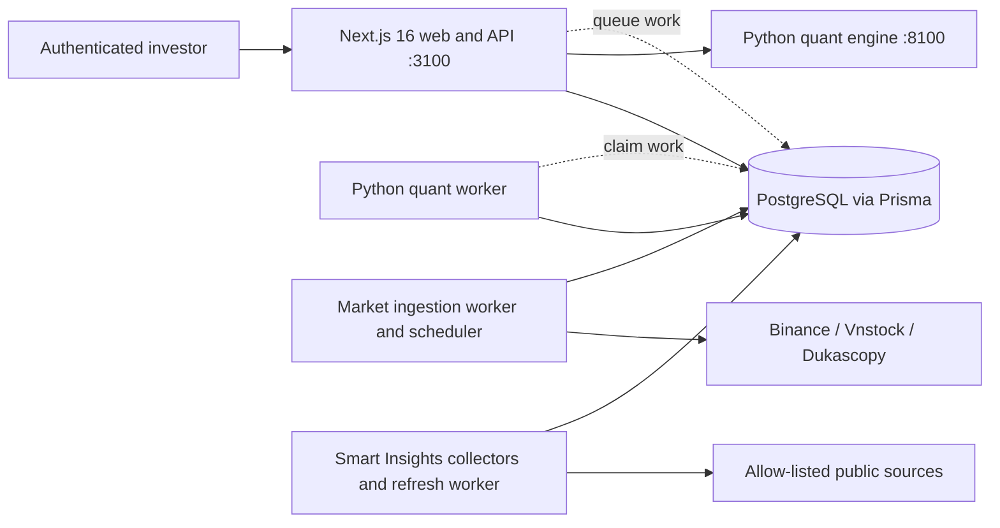
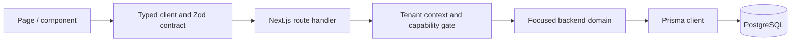
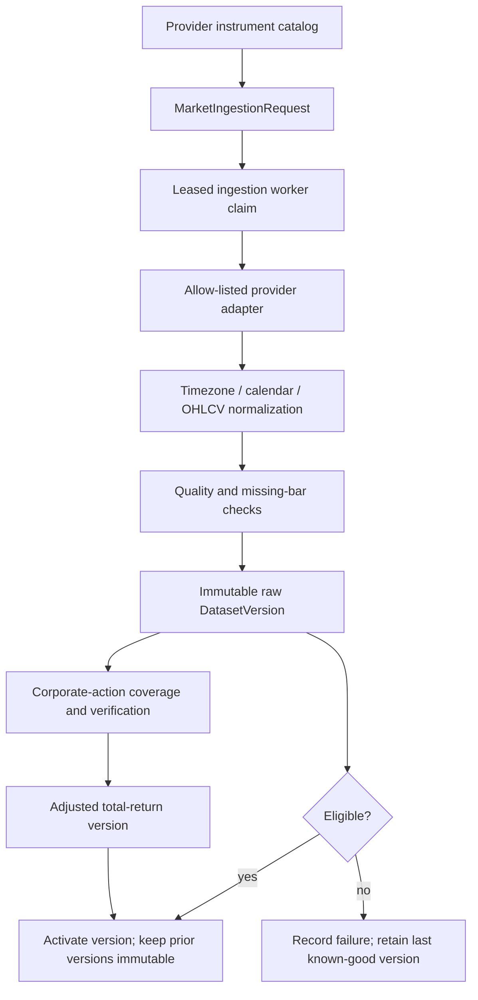
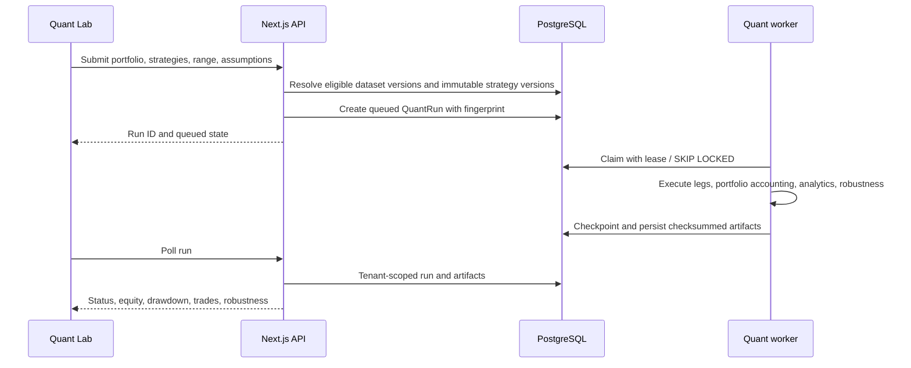
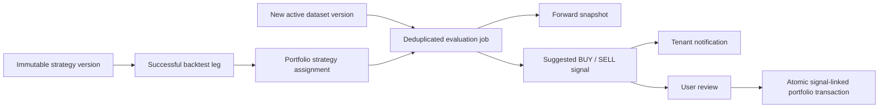
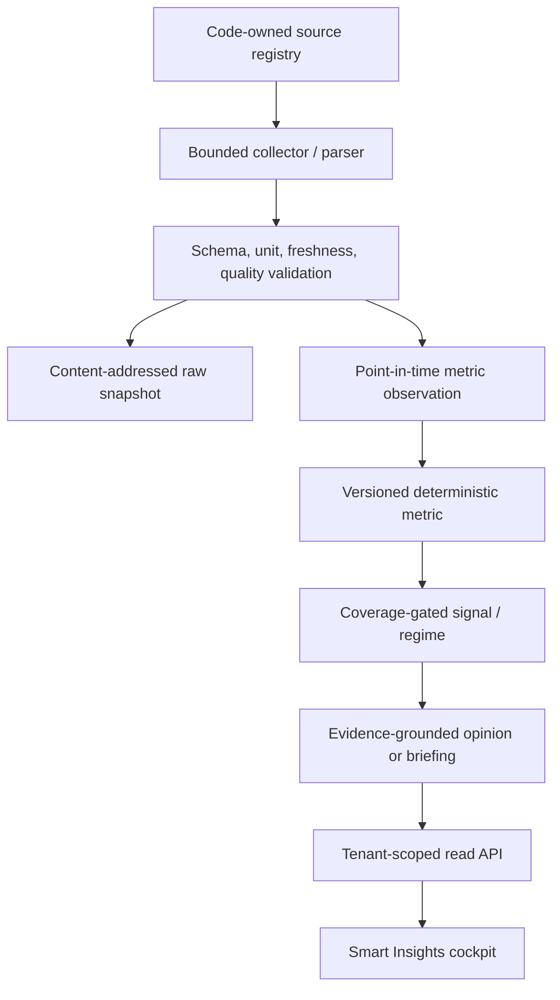

# Quant Insight Radar Architecture

This document is the current architecture source of truth for the repository. It describes the
software that exists on `main`; delivery history belongs in Git, and detailed operating procedures
belong in the linked runbooks.

## System context

Quant Insight Radar is a tenant-aware investment research application for Vietnam equities,
cryptocurrency, and XAU/USD. The browser uses one Next.js application for the product UI and API.
PostgreSQL is the shared system of record. Python processes own expensive ingestion, portfolio
optimization, factor calculations, backtests, forward-signal evaluation, and Smart Insights
collection.

The web process never performs long-running backtests or broad provider ingestion synchronously.
PostgreSQL queues and immutable records are the coordination boundary between web and workers.

## Runtime topology

| Process                       | Entry point                                                                                             | Responsibility                                                                                  | State boundary                               |
| ----------------------------- | ------------------------------------------------------------------------------------------------------- | ----------------------------------------------------------------------------------------------- | -------------------------------------------- |
| Web and API                   | [`src/app`](../src/app), `npm run dev:web`                                                              | Pages, tenant authorization, API validation, read models, mutations                             | Prisma/PostgreSQL                            |
| Local supervisor              | [`scripts/dev-local.mjs`](../scripts/dev-local.mjs), `npm run dev`                                      | Starts web, quant worker, quant engine, ingestion worker, and Smart Insights refresh worker     | Child-process lifecycle only                 |
| Quant engine                  | [`quant-worker/service.py`](../quant-worker/service.py)                                                 | Bounded synchronous optimization and Vietnam factor endpoints                                   | Stateless request/response                   |
| Quant worker                  | [`quant-worker/worker.py`](../quant-worker/worker.py)                                                   | Claims backtests and forward evaluations; leases, executes, checkpoints, and persists artifacts | PostgreSQL queues and leases                 |
| Ingestion worker              | [`quant-worker/process_ingestion_requests.py`](../quant-worker/process_ingestion_requests.py)           | Claims provider requests and publishes dataset versions                                         | PostgreSQL ingestion queue                   |
| Ingestion scheduler           | [`scripts/run-market-ingestion.ps1`](../scripts/run-market-ingestion.ps1)                               | Synchronizes catalogs, queues due work, refreshes corporate actions, records scheduler health   | PostgreSQL advisory locks and scheduler rows |
| Smart Insights collector      | [`quant-worker/collect_smart_insights.py`](../quant-worker/collect_smart_insights.py)                   | Runs allow-listed collectors and deterministic metric pipelines                                 | Immutable artifacts and observations         |
| Smart Insights refresh worker | [`quant-worker/process_smart_insight_refreshes.py`](../quant-worker/process_smart_insight_refreshes.py) | Processes tenant-requested opinion refresh jobs                                                 | PostgreSQL refresh queue                     |

Production scheduling artifacts for market ingestion live under
[`deploy/windows`](../deploy/windows). Smart Insights scheduling remains an explicit deployment
responsibility described in the [operations runbook](operations/smart-insights-runbook.md).

## Web application boundary

The Next.js App Router owns the application shell and four primary authenticated product surfaces:

- dashboard: [`src/app/page.tsx`](../src/app/page.tsx);
- Mock Portfolio: [`src/app/portfolio/page.tsx`](../src/app/portfolio/page.tsx);
- Quant Lab: [`src/app/quant-lab/page.tsx`](../src/app/quant-lab/page.tsx);
- onboarding and authentication: [`src/app/onboarding`](../src/app/onboarding),
  [`src/app/sign-in`](../src/app/sign-in), and [`src/app/sign-up`](../src/app/sign-up).

UI components call typed clients in `src/lib`; clients call route handlers under
[`src/app/api`](../src/app/api). Route handlers authenticate and authorize, validate input, delegate
to a focused backend domain module, and normalize errors through
[`src/app/api/_lib.ts`](../src/app/api/_lib.ts). They do not contain provider adapters or quant
algorithms.

## Authentication and tenancy

Better Auth and its Prisma adapter are configured under [`src/lib/auth`](../src/lib/auth).
[`requireTenantContext`](../src/lib/auth/tenant-context.ts) resolves the authenticated user,
active organization membership, and normalized role. [`permissions.ts`](../src/lib/auth/permissions.ts)
is the capability matrix.

Tenant-owned reads and writes must include `organizationId` from `TenantContext`; user-provided IDs
never establish tenancy. Worker imports resolve their organization from the code-owned
`QUANT_WORKER_ORGANIZATION_SLUG` through
[`worker-context.ts`](../src/lib/backend/worker-context.ts). Public market and research records are
explicitly separated from tenant-owned portfolio, strategy, notification, and research-run data.

The important persistence roots are:

- identity and tenancy: `AppUser`, `Session`, `Account`, `Organization`, `Membership`, `Invitation`;
- tenant portfolio: `Portfolio`, `PortfolioPosition`, `PortfolioTransaction`, `WatchlistItem`;
- tenant research and strategy activity: `ResearchRun`, `QuantRun`, `CustomStrategy`,
  `StrategyAssignment`, `StrategySignal`, `Notification`;
- public/reference data: `Asset`, `DataProvider`, `ProviderInstrument`, `Dataset`,
  `DatasetVersion`, market calendars, listing periods, and metric definitions.

All model definitions and delete behavior are authoritative in
[`prisma/schema.prisma`](../prisma/schema.prisma). Migrations, not the schema file alone, are the
deployment history.

## Domain ownership map

| Domain                       | UI / client                                                                      | API                                                                                 | Server ownership                                                                                                                                                                                                                      | Python ownership                                                                                             | Core persistence                                                                   |
| ---------------------------- | -------------------------------------------------------------------------------- | ----------------------------------------------------------------------------------- | ------------------------------------------------------------------------------------------------------------------------------------------------------------------------------------------------------------------------------------- | ------------------------------------------------------------------------------------------------------------ | ---------------------------------------------------------------------------------- |
| Auth and tenant              | `src/components/AuthForm.tsx`, `src/lib/auth`                                    | `/api/auth/*`                                                                       | `src/lib/auth`, organization provisioning                                                                                                                                                                                             | None                                                                                                         | users, sessions, organizations, memberships                                        |
| Market data                  | ticker, asset pickers, health panel                                              | `/api/market/*`, `/api/quant/assets`                                                | [`market-repository.ts`](../src/lib/backend/market-repository.ts), [`ingestion-requests.ts`](../src/lib/backend/ingestion-requests.ts), [`quant-assets.ts`](../src/lib/backend/quant-assets.ts)                                       | providers, publication, quality, calendars                                                                   | assets, bars, datasets, versions, ingestion requests/runs                          |
| Mock Portfolio               | [`MockPortfolio.tsx`](../src/components/MockPortfolio.tsx) and `mock-portfolio/` | `/api/portfolio/*`                                                                  | [`portfolio-repository.ts`](../src/lib/backend/portfolio-repository.ts)                                                                                                                                                               | Forward evaluator reads assignments and datasets                                                             | portfolios, positions, transactions                                                |
| Optimizer and factors        | optimizer/factor panels in Quant Lab                                             | `/api/quant/allocations/optimize`, `/api/quant/factors/vietnam`                     | [`quant-optimizer.ts`](../src/lib/backend/quant-optimizer.ts), [`factor-lab.ts`](../src/lib/backend/factor-lab.ts)                                                                                                                    | [`optimizer.py`](../quant-worker/backtest/optimizer.py), [`factors.py`](../quant-worker/backtest/factors.py) | immutable dataset inputs; results returned synchronously                           |
| Portfolio backtest           | builder and `backtest-results/`                                                  | `/api/quant/runs*`, `/api/quant/strategies`                                         | [`quant-runs.ts`](../src/lib/backend/quant-runs.ts)                                                                                                                                                                                   | `backtest/run_*`, engine, analytics, robustness                                                              | quant runs, legs, artifacts, dataset versions                                      |
| Strategies and forward tests | Strategy Lab, portfolio assignment panels, notification center                   | `/api/quant/custom-strategies*`, `/api/portfolio/strategy-*`, `/api/notifications*` | [`custom-strategies.ts`](../src/lib/backend/custom-strategies.ts), [`strategy-forward-tests.ts`](../src/lib/backend/strategy-forward-tests.ts), [`strategy-forward-repository.ts`](../src/lib/backend/strategy-forward-repository.ts) | custom execution, signal jobs, forward evaluator                                                             | immutable strategy versions, assignments, jobs, snapshots, signals, notifications  |
| Smart Insights               | `src/components/SmartInsights.tsx`, `smart-insights/`                            | `/api/smart-insights/*`, `/api/assets/[symbol]/intelligence`                        | Smart Insights backend modules and [`research-repository.ts`](../src/lib/backend/research-repository.ts)                                                                                                                              | `smart_insights/` collectors, metrics, pipelines, grounding                                                  | raw snapshots, provider runs, observations, signals, briefings, evidence, opinions |

Repository-boundary tests in
[`src/lib/backend/repository-boundaries.test.ts`](../src/lib/backend/repository-boundaries.test.ts)
guard against rebuilding a shared database facade.

## Market-data lifecycle

Market data uses provider-specific adapters but a shared immutable publication contract. Current
free-provider scope is Binance USDT spot, Vnstock/VCI HOSE equities, and Dukascopy XAU/USD. The
provider catalog decides what can be requested; no route accepts an arbitrary provider URL.

Core Python modules are under [`quant-worker/backtest`](../quant-worker/backtest):

- provider fetch and normalization: `providers.py`, `ingestion.py`, `market_calendar.py`;
- queue and leases: `ingestion_repository.py`;
- immutable publication: `publication.py`, `adjusted_publication.py`;
- quality: `quality.py`, `adjustment_audit.py`;
- Vietnam corporate actions: `corporate_actions.py`, `adjustments.py`.

Adjusted Vietnam publication fails closed when corporate-action coverage does not contain the raw
range, a price-affecting action is unverified, or data-quality checks fail. A fixture is never
substituted for a failed live update. Dataset readiness in the UI is operational evidence, not a
claim that every requested symbol already has production-quality historical coverage; current
coverage reports remain under [`docs/verification`](verification).

## Optimizer and backtest lifecycle

Portfolio optimization is synchronous but bounded. The API loads eligible immutable datasets,
aligns return histories, and calls the private Python engine. Backtests are asynchronous because
they can be expensive and must support 20–50 concurrent queued jobs.

TypeScript request/result contracts live under [`src/lib/backtest`](../src/lib/backtest). The
worker separates queue ownership (`run_repository.py`), orchestration (`run_execution.py`), market
and strategy mechanics (`engine.py`, `strategies.py`, `custom_execution.py`), portfolio accounting
(`portfolio.py`), and result analysis (`analytics.py`, `robustness.py`). Dataset version IDs,
strategy versions, parameters, assumptions, implementation hashes, and artifacts make a completed
run reproducible.

## Strategy and forward-testing lifecycle

Built-in strategy definitions and tenant-owned custom strategies produce immutable versions. DCA
and price-threshold rules are executable; fundamental rules remain unavailable until point-in-time
financial-statement ingestion exists.

Applying a successful backtest leg creates a strategy assignment; it does not alter holdings. When
a newer eligible dataset is published, a deduplicated evaluation job advances assignment state and
may create a signal, snapshot, and notification. Executing a suggested signal uses the normal
portfolio transaction path and atomically links the transaction to the signal.

## Smart Insights lifecycle

Smart Insights is evidence-first. Source definitions in
[`quant-worker/smart_insights/sources.py`](../quant-worker/smart_insights/sources.py) own fixed URLs,
terms, schedules, freshness rules, and enablement. Collectors fetch only allow-listed sources.
Parsers publish immutable, content-addressed raw artifacts and normalized point-in-time
observations. Deterministic metric pipelines compute regimes and signals only when configured
fresh-weight coverage passes the required gate.

LLM synthesis is downstream of deterministic inputs and evidence gates; it does not modify the
quantitative score. Raw artifact paths, provider payloads, and internal diagnostics are not exposed
through consumer APIs. Provider activation, smoke commands, replay, and rollback are documented in
the [Smart Insights operations runbook](operations/smart-insights-runbook.md).

## Persistence map

The schema is organized by behavior even though all models share one Prisma schema:

| Group                 | Principal models                                                                                                              | Invariant                                                            |
| --------------------- | ----------------------------------------------------------------------------------------------------------------------------- | -------------------------------------------------------------------- |
| Identity and tenancy  | `AppUser`, `Session`, `Organization`, `Membership`                                                                            | Tenant context derives from authenticated membership                 |
| Portfolio             | `Portfolio`, `PortfolioPosition`, `PortfolioTransaction`                                                                      | Transactions are the accounting mutation boundary                    |
| Market reference      | `Asset`, `DataProvider`, `ProviderInstrument`, `AssetListingPeriod`, `MarketCalendarVersion`                                  | Provider identity and historical listing coverage are explicit       |
| Immutable market data | `Dataset`, `DatasetVersion`, `DatasetBar`, `DataQualityIssue`                                                                 | Active version may change; historical versions and lineage do not    |
| Work queues           | `MarketIngestionRequest`, `QuantRun`, `StrategyEvaluationJob`, `SmartInsightRefreshRequest`                                   | Claims are leased, retry-bounded, and idempotent                     |
| Strategy lifecycle    | `StrategyVersion`, `CustomStrategyVersion`, `StrategyAssignment`, `StrategySignal`, `StrategyForwardSnapshot`, `Notification` | Versions are frozen; active assignment and signals are tenant-scoped |
| Smart Insights        | `ProviderRun`, `InsightRawSnapshot`, `MetricObservation`, `SignalSnapshot`, `DailyBriefing`, research/evidence models         | Published conclusions retain source and methodology provenance       |

Use Prisma only through [`src/lib/db/prisma.ts`](../src/lib/db/prisma.ts) in the web process. Python
workers use psycopg and explicit repositories because they own queue locking and bulk scientific
workloads.

## Reliability and security boundaries

- Authentication is required at the page/API boundary; capability checks precede mutations.
- All tenant-owned queries include organization scope. Cross-tenant identifiers return not found or
  forbidden without revealing ownership.
- Queue claims use PostgreSQL leases, bounded retries, and idempotency keys; stale claims are
  recovered rather than duplicated.
- Provider endpoints and symbols are code-owned or catalog-approved. Arbitrary crawl URLs are not
  accepted from API or scheduler input.
- Live ingestion and Smart Insights fail closed. Missing/stale data is visible as a state, not
  replaced by a simulated value.
- Test and seed database wrappers require local hosts and explicit safe database names.
- Secrets live in environment files and must never enter logs, artifacts, fixtures, or client
  responses.

## Verification layers

| Layer                | Command / evidence                                           | What it proves                                                         |
| -------------------- | ------------------------------------------------------------ | ---------------------------------------------------------------------- |
| Static quality       | `npm run lint`, `npm run format:check`, `npm run typecheck`  | Source style and TypeScript contracts                                  |
| Web/unit             | `npm test`                                                   | UI, API, backend, contracts, and boundary tests                        |
| Python/unit          | `npm run test:python`                                        | Providers, quant math, worker lifecycle, Smart Insights pipelines      |
| Database integration | `npm run test:integration` with isolated `TEST_DATABASE_URL` | Real PostgreSQL constraints, tenant isolation, leases, concurrency     |
| Browser              | `npm run test:e2e` with the documented E2E stack             | Authenticated product flows in a browser                               |
| Build                | `npm run build`                                              | Production Next.js compilation and route generation                    |
| Data truth           | health APIs and [`docs/verification`](verification)          | Coverage, freshness, quality, and capacity at a measured point in time |

Passing source tests does not prove current provider availability or dataset completeness. Those
claims require database and health evidence from the target environment.

## Where to make changes

| Change                      | Start here                                                 | Also verify                                                              |
| --------------------------- | ---------------------------------------------------------- | ------------------------------------------------------------------------ |
| Add or change a page        | `src/app`, owning component directory                      | i18n dictionaries, route clients, Playwright                             |
| Change tenant permissions   | `src/lib/auth/permissions.ts`, `tenant-context.ts`         | two-organization integration tests and route tests                       |
| Add a market provider       | `quant-worker/backtest/providers.py`, source catalog       | ingestion CLI tests, publication/quality, provider terms, health UI      |
| Change dataset eligibility  | publication and quality modules                            | active-version queries, readiness API, backtest contracts                |
| Add a built-in strategy     | worker strategy factory/catalog and TypeScript catalog     | implementation hash, golden backtest, forward evaluator                  |
| Add a custom rule type      | `src/lib/custom-strategies`, worker custom rules/execution | immutable versioning, historical and forward execution                   |
| Change portfolio accounting | `portfolio-repository.ts`, worker portfolio accounting     | transactions, cash flow, TWR/PnL, signal-linked atomicity                |
| Change optimizer math       | `quant-worker/backtest/optimizer.py`                       | engine request contract, method UI, validation/OOS tests                 |
| Change backtest execution   | `quant-worker/backtest/run_*` and engine modules           | leases, cancellation, artifacts, result-model parsing, capacity          |
| Add Smart Insights evidence | source registry, collector, metric definition/pipeline     | live-smoke gate, artifact provenance, health API, consumer source labels |
| Change database shape       | `prisma/schema.prisma` plus a new migration                | Prisma validation, Python SQL repositories, integration tests            |
| Change scheduling           | `scripts/*.ps1`, worker watch loops, `deploy/windows`      | overlap policy, scheduler health, retry and stale recovery               |

## Documentation ownership

- Current architecture: this file.
- Setup and common commands: [root README](../README.md).
- Documentation index and retention status: [`docs/README.md`](README.md).
- Smart Insights operations: [`docs/operations/smart-insights-runbook.md`](operations/smart-insights-runbook.md).
- Point-in-time QA and verification evidence: [`docs/qa`](qa),
  [`docs/verification`](verification), and [`docs/smart-insights`](smart-insights).
- Approved unfinished delivery work only: `docs/superpowers/plans` and
  `docs/superpowers/specs`.
